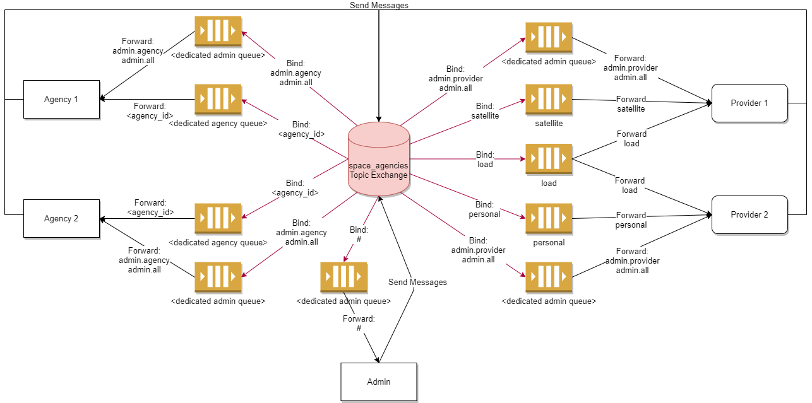

# Space Agencies written in RabbitMQ

This is a repository for my university assignment for writing a simple distributed system utilizing rabbitmq. 
The system is divided into:
- consumers (called agencies)
- producers (called providers)
- admin module (receiving all traffic inside the system)

## Installation and running

First you need to have elixir and erlang-dev installed.

Then just simply type these commands to clone: 

    $ git clone https://github.com/Vetchu/space_agency_RabbitMQ
    $ cd space_agency_RabbitMQ

Install and compile dependencies:

    $ mix deps.get
    $ mix deps.compile

Compile and run:

    $ mix compile
    $ mix run run.exs

## Diagram of system

